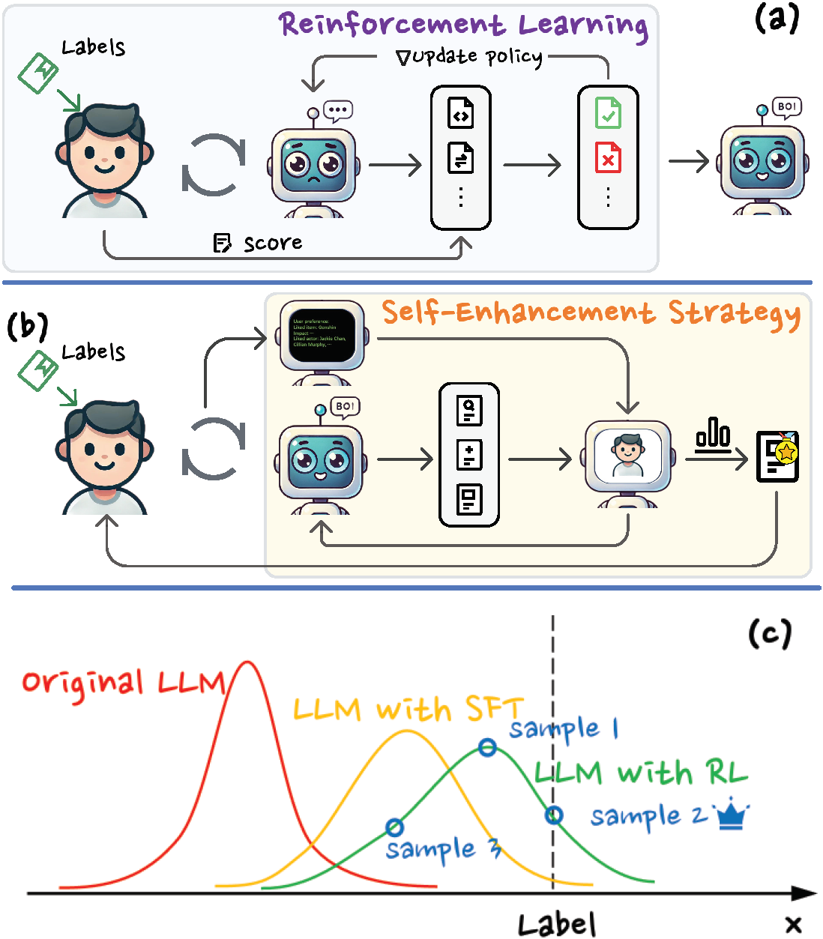
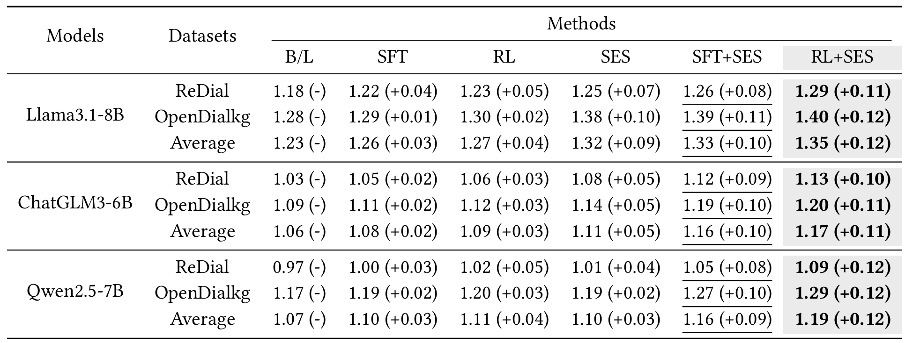

# USB_Rec
The official code of Recsys'25 paper 'USB-Rec: An Effective Framework for Improving Conversational Recommendation Capability of Large Language Model'

## Overview
<p align="center">
  
</p>

## Configs Setting
Set the `model` in `SESConfig` you want to use in `ses_functions.py`, which can be a locally deployed LLM or an open-sourced LLM.

Then set the `api_key` and `base_url` in `create_client` function if you use an open-sourced LLM.


## PODCS
run `podcs_main.ipynb` and results will be saved in `po_results.jsonl`.
We deploy [llama-factory](https://github.com/hiyouga/LLaMA-Factory) to training the LLMs.

## SES
run `ses_main.ipynb` and results will be saved in `results.jsonl`.


## Dataset
We use the dataset from [iEval](https://github.com/RUCAIBox/iEvaLM-CRS).

## Results
<p align="center">
  
</p>


## Citing

Please cite the following paper if you find our code helpful.

```bibtex
@inproceedings{wen2025usb,
  title={USB-Rec: An Effective Framework for Improving Conversational Recommendation Capability of Large Language Model},
  author={Wen, Jianyu and Wang, Jingyun and Yan, Cilin and Cai, Jiayin and Jiang, Xiaolong and Zhang, Ying},
  booktitle={Proceedings of the Nineteenth ACM Conference on Recommender Systems},
  pages={472--481},
  year={2025}
}
```
